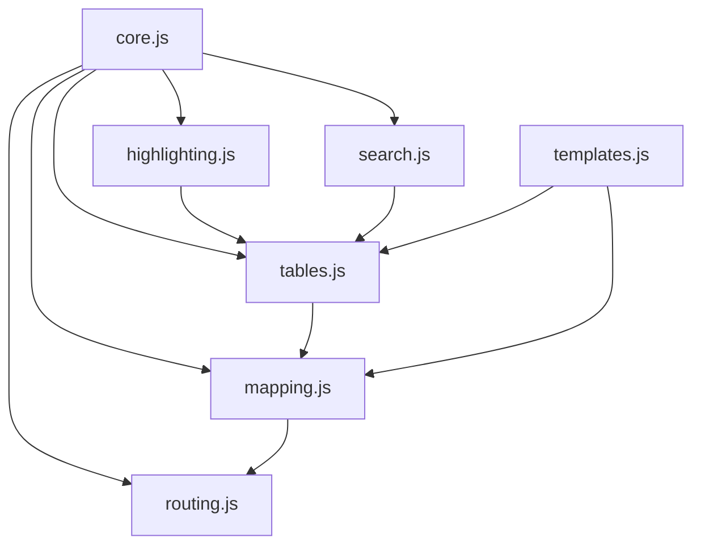

# 🔧 JavaScript Modularization Plan

## Current Status
- **File**: `app/static/script.js`
- **Size**: 2300+ lines
- **Issues**: Monolithic, hard to maintain, poor separation of concerns

## Proposed Module Structure

### 1. `core.js` - Application Core (Lines 1-20, 1076-1120)
```javascript
// Global variables and app initialization
const appLeaflet = { map: null, layerControl: null }
const layerTracker = {}
const initApp = () => { /* App initialization */ }
```

### 2. `highlighting.js` - Map Feature Highlighting (Lines 20-96)
```javascript
// Map highlighting system
const mapHighlighting = {
    highlightLayer: null,
    highlightedFeatures: new Map(),
    init() { /* Initialize highlight layer */ },
    clearAll() { /* Clear all highlights */ },
    addHighlight(rowIndex, featureData, geojsonLayer) { /* Add highlight */ },
    removeHighlight(rowIndex) { /* Remove highlight */ }
}
```

### 3. `search.js` - Table Search & Filtering (Lines 96-340)
```javascript
// Search and filter functionality
const initializeTableSearch = (containerId) => { /* Search initialization */ }
const populateColumnDropdown = (dropdown, table) => { /* Dropdown population */ }
const performSearch = (table, columnIndex, searchText) => { /* Search execution */ }
const highlightTextInCell = (cell, searchText) => { /* Text highlighting */ }
const clearAllHighlights = (table) => { /* Clear search highlights */ }
```

### 4. `tables.js` - Table Management (Lines 340-980)
```javascript
// Table row selection, filtering, and management
const initializeTableRowSelection = (containerId) => { /* Row selection */ }
const toggleRowSelection = (row) => { /* Toggle row state */ }
const handleTableFilter = (container, action) => { /* Filter controls */ }
const showSelectedRows = (tbody, dataRows, allRows) => { /* Show selected */ }
const showUnselectedRows = (tbody, dataRows, allRows) => { /* Show unselected */ }
const createRouteTable = (responseData) => { /* Table creation */ }
const makeSortable = (containerId) => { /* Sortable columns */ }
```

### 5. `mapping.js` - Map Interactions (Lines 980-1500)
```javascript
// Leaflet map functionality
const handleDrop = (e) => { /* File drop handling */ }
const removeLayer = (id) => { /* Layer removal */ }
const showAttributeTable = (layerId, layerName, geoJsonData) => { /* Attribute tables */ }
const setupAttributeTableDrag = (container) => { /* Draggable tables */ }
```

### 6. `routing.js` - Routing Functions (Lines 1500-2300)
```javascript
// Routing calculations and API calls
const handleZipAddrQuery = () => { /* Zip to address routing */ }
const zipAddrQuery = (startInput, endPoint) => { /* Zip-address query */ }
const addrZipQuery = (startPoint, endInput) => { /* Address-zip query */ }
const addrQuery = (startPoint, endPoint) => { /* Address routing */ }
const zipQuery = (startInput, endInput) => { /* Zip code routing */ }
const handleZipRouting = () => { /* Zip routing handler */ }
const handleRouting = () => { /* Main routing handler */ }
```

## Implementation Steps

1. **Create Module Files**
   ```bash
   # Create modular JavaScript files
   touch app/static/js/core.js
   touch app/static/js/highlighting.js
   touch app/static/js/search.js
   touch app/static/js/tables.js
   touch app/static/js/mapping.js
   touch app/static/js/routing.js
   ```

2. **Extract Code Sections**
   - Move related functions to appropriate modules
   - Maintain global variable access where needed
   - Preserve function dependencies

3. **Update HTML Template**
   ```html
   <!-- Replace single script with modules -->
   <script src="static/js/core.js"></script>
   <script src="static/js/highlighting.js"></script>
   <script src="static/js/search.js"></script>
   <script src="static/js/tables.js"></script>
   <script src="static/js/mapping.js"></script>
   <script src="static/js/routing.js"></script>
   <script src="static/js/templates.js"></script>
   ```

4. **Testing & Validation**
   - Test all functionality after modularization
   - Ensure no broken dependencies
   - Validate performance impact

## Benefits of Modularization

- **Maintainability**: Easier to locate and modify specific functionality
- **Readability**: Smaller, focused files are easier to understand
- **Collaboration**: Multiple developers can work on different modules
- **Testing**: Individual modules can be tested in isolation
- **Performance**: Potential for lazy loading of modules
- **Debugging**: Easier to identify and fix issues

## Dependencies Map



## Next Steps

1. ✅ Create module files in `app/static/js/`
2. ⏳ Extract code sections (manual process)
3. ⏳ Update HTML template references
4. ⏳ Test functionality
5. ⏳ Optimize and refine

This modularization will significantly improve code organization and maintainability!
<div align="center">

---
### Developed by **Rajat Saini**
---

</div>
